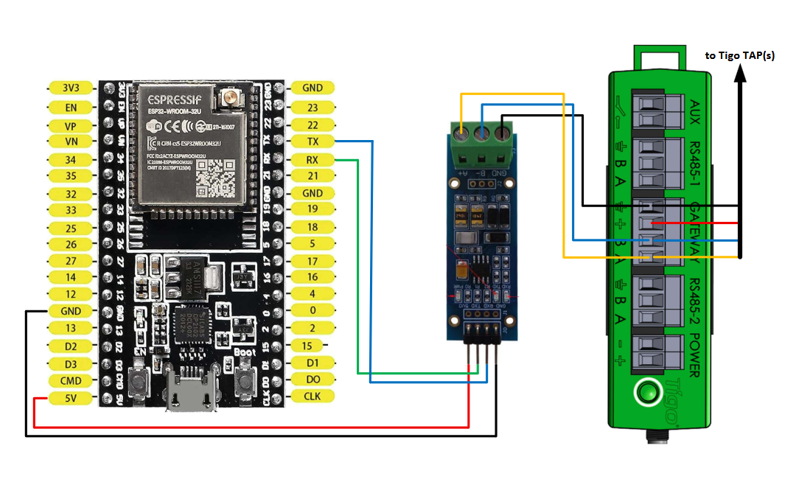

# `ESPHome Component for Tigo TAP`
This Project implements a ESPHome Component for monitoring a [Tigo Tap](https://tigoenergy.com/product/tigo-access-point) and connected Solar Modules.
It thereby eleminates the need for the proprietary Tigo Cloud for Monitoring, while retaining more Information at a higher resolution. 
Data can be read serveral times per minute as opposed to 15min/1min(unpaid/paid) readout off the Tigo Cloud.

**Based on the reverse-engineering Projekt [TapTap](https://github.com/willglynn/taptap) by Will Glynn.**

**This is not a reimplementaion of the [Tigo CCA](https://tigoenergy.com/product/cloud-connect-advanced), you still need a Tigo CCA and one or more connected Tigo Tap Modules**
As the Tigo CCA also implements important safety features such as a rapid shutdown which we don't want to mess with.
Therefore this project is (fore now) just focused on monitoring the data provided by connected Solar Modules.

## Hardware needed
- [ESP32 board](https://www.amazon.de/dp/B0D7ZGT9PM)
- [TTL to RS485 Converter](https://www.amazon.de/dp/B07B667STP)

## Connection Diagramm

## ESPHome Configuration
There is a [Example-YAML](Example_TigoTap.yaml) provided with this Projekt. Setup should be pretty straight forward. Just setup a UART followed by a TigoTap Component.
Then you are ready to setup the sensors you need. Each Sensor needs to include a barcode, which corresponeds with the barcode of the [TS4-A-O](https://tigoenergy.com/product/ts4-a-o).
Please take a look at the [Example-YAML](Example_TigoTap.yaml) for supported sensors.

**Please Note: It can take up to 24 Houres for the Sensors to deliver the first Data, as the Barcodes are only rarely exchanged on the bus.**
